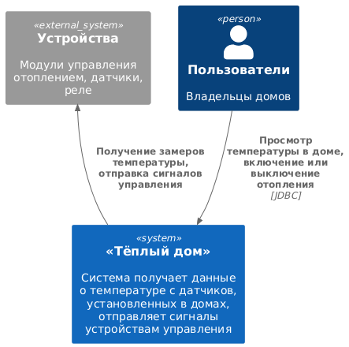
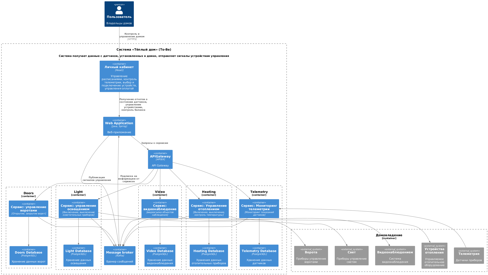
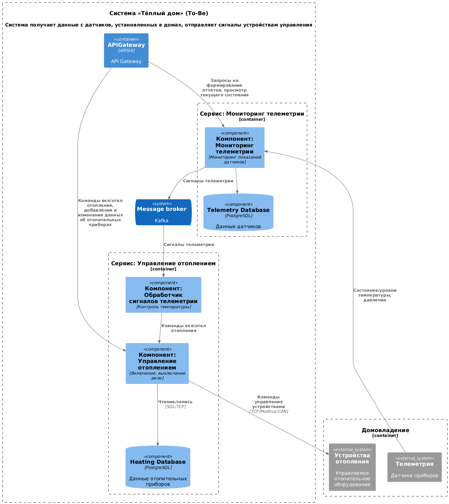
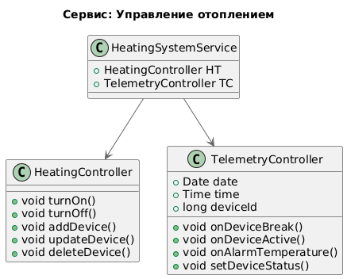

# Задание 1. Анализ и планирование

### 1. Описание функциональности монолитного приложения

**Управление отоплением:**

- Пользователи могут включать/выключать отопление в своих домах. 
- Система поддерживает сигналы сервера для управления реле

**Мониторинг температуры:**

- Пользователи могут просматривать текущую температуру в своих домах.
- Система получает данные о температуре с датчиков, установленных в домах, с помощью запросов от сервера к датчику.

### 2. Анализ архитектуры монолитного приложения

- Язык программирования: Java, замена нецелесообразна
- База данных: PostgreSQL, имеет средства репликации и кэширования
- Архитектура: Монолитная, все компоненты системы (обработка запросов, бизнес-логика, работа с данными) находятся в рамках одного приложения.
- Взаимодействие: Синхронное, запросы обрабатываются последовательно.
- Масштабируемость: Ограничена, так как монолит сложно масштабировать по частям.
- Развёртывание: Требует остановки всего приложения.

### 3. Определение доменов и границы контекстов (To-Be)

- Домен: Управление отоплением

- Домен: Мониторинг телеметрии

- Домен: Управление освещением

- Домен: Управление автоматическими воротами

- Домен: Видеонаблюдение за домом

- Домен: Личный кабинет пользователя 
   - поддомен управления расписаниями
      - контекст: планирование расписания
      - контекст: публикация расписания
   - поддомен контроля телеметрии
   - поддомен выбора и подключения модулей умного дома (устройств)
   - поддомен управления оплатой

- Домен: продажа услуг
   - поддомен управления услугами
   - поддомен управления пользователями
   - поддомен управления платежами
      - контекст: обработка транзакций
      - контекст: ведение журнала транзакций

- Домен: Управление устройствами 
   - поддомен отслеживания устройств
   - поддомен отчётности и аналитики

### **4. Проблемы монолитного решения**

- Каждая установка сопровождается выездом специалиста по подключению системы отопления в доме к текущей версии системы. 
  Централизованная база данных и установка программы отсутствует.
- Трудно масштабировать отдельные компоненты системы - придётся масштабировать приложение целиком.
- Обновление версии требует выезда специалиста и переустановки всего приложения после его остановки 
- Не позволяет гибко расширять целевую экосистему (включать и выключать свет, запирать и отпирать автоматические ворота, удалённо наблюдать за домом, 
  подключать к экосистеме устройства партнёров по стандартным протоколам)
- Каждый микросервис ориентирован на конкретную бизнес-функцию и разрабатывается вокруг неё. 
  Это упрощает управление системой и её развитие в соответствии с бизнес-требованиями.

### 5. Визуализация контекста системы — диаграмма С4

[Используем PlantUML Web Server](https://www.plantuml.com/plantuml/uml/7Cmn3i8m38NXlQU0ZQN9miG4wWfI5sRafXQrv3YHxOZhqtHwqYzzxsuEwYtpS2P9t5OyRUxLRZ4g_CANV6jBCzHKn54yf99ZPP1kHlELQOdJTPnxUh-UCOCvwfu-qow013NK_Z_Cg5RaKezvC87zwwPwdGI2CDZp51igJEuXZ3-DfSIQHZgrWG8xmA356OdM9aGjRIx8XSE3kuGdcE-DdBaSXFMWkjtzvcTs5W9NnmGPKdl6dDyf8XiYHeh4rJLyupB23B4WzcYXuoR3KjZwKQrvJw_RHgVuR1JNt_YqL-IaX5YKX7LQw7qWiO4iA14vOkJzO4yqYMqeR8GLLYJ63fahaJc7VKKZjC-93OJadiG4lmeJECwaJBxsICaib6paC2rJa3CAA4nSBaNXR2nhQbBgXvH8kKirOZ8ij58rMF9uGomD4XjlUsYTzxgDTg_RzEh0LrMfwEAT9pCAikozkaLEOlBDaRe8_9idWLCZGZ16xR9zqxhodwEQPx8jlLHrcEjoAbdLxMtTGhytUaTUPs8UgeUn_5zTvryY6LDiYKnD7GYmyumnmoX2QY-xrqZK9ISMLcT-byf5vukparFcEsxVNVCVyWS0)

# Задание 2. Проектирование микросервисной архитектуры

**Диаграмма контейнеров (Containers)**

[Используем PlantUML Web Server](https://www.plantuml.com/plantuml/uml/dLZFJnj75BxxhvZwP2GJBZtb54AgaXOgYadR6rhC55QnTwtTTL8KHGBQf4gfWe8gLMghegJggHTmSBFym4Zv2sR_etxlpPXXcCKbd7PdvxtlVUzxRtxOTz8iIB9kkrNvA8oQhUwox2OjiPfbdVJsn4GIFBwr4cQhtQLkAfDc76Koocuru_R4VDWCakNuYr1sP6jYwkFnkLOGPGzcPoRQGPh919yMf-9s9ux8eqC1AdCoIUEerk77P2iCqhgegbqrKCV5p-eTdZsrLsogFer5bIPtrB7QKmVwK_6ys18O3DG9sLR7Aeqrn6hNKdwS8xvMUR51EB3R4-__KM-AL-eC25lgqFY_FnQrXNZyhXoh-Xwm9KhV5pyYTh_OX0zUJjKf0FgYsC2OU68wLqV4f2vWJFvaXJ58zxLzyKoedea9dsTreGQmEolMOGkxOfi201DGR-6oHomD6cm6wf3UI1TrWi_MaGA0z3P4g4oXBa4OoMJnRjoDbeDahJOTes0FK3FAxfUXOaPCTbNzwjWJ8-3Y9zzbjMaPP66qeh-Gsry-2Sr-084i0JPrC-9eVMkS3uiA5psXzZ6vZeGETDM7Z2uIMf1jj4gGTHFPa54QSovl28WZz8cSOK0vsehaWkdaEWW5S87lnN5YqzpHHbGzHjgrhYY5hpdnxraVCCbT-9bmPJMp-AzX3QxNnIusj3tLpCNzAboMyKNUETTom6sp3tbVsjh2jwIlUwKkjfEUblQIkxhynGIQuacb8iIvR-rhkJJPwS0QBm9lBUmMMHX7HEgpu55G5urEWcOpQxolziTDoOu1-A_jK0Vry-3RXm4yPcMQ1YjIB2NnGvaG1iyms2ik-14KN2Sf1zHgnGi3U7W9S7Bk_gT19Xy7Qt2rWweUDUv_Ozx4SC9rRuIPf9Y_gnoTTweLEM9bSyGpHP-NGJDpLebJRdm0ppCg5AQu4jHITK92dSmAf0sHwkZsFflr49SxId3Zm_W0hYWjE0sZ-1jAlNGt4MPjxt7_aLoKiDyIPgz0KkQDzX8XBjYoIKCcZyAcv4waYY0KqhmjofHmjXQdYNSkfwEJzh-MAtO2I8gDd203rXsoygdU2x9WAKYbJKaCFn69kJZDLh0FVJd3bFvczgTMDXm8TiFtjpqpuUzAGZozGk85sP9jcINKckVlvJBFnb6OnRIUVAN_84c82GNbjdnRsaYKLganTHGtzJkpInzwnvydw3bVgwhDuTgwghwZgnTsf7oqnzDsnKzFDZrzHNjUSyydjpynEgAUmfDRa5IoNnmtekjpi0ffgZTMnmOQgGiVJW3ZfwUBdlumNGRcn7hXBzlH2zU7sBpUal48Mn5rNZSLqKkcs1uf9f_80EMd9wQUlafCF4UStqJLMc3B_WbFh4A-Eka1Rp8zKNwKbp6nAcd2DrLf97Mh6DqcvcNBlUuFZypVBktKAY_jBdlRvvwQNbYOQm2VSHdg_AAXTeTtTkT0eU5Gg05T24XBZ8jjDihzgtmvZz8RUVan3JrmYoUvw4G7Mo8xvAclC62BAD2DeYB-SzBD-H50L4fFQ8EdSOIR_e6vHb2V40nK1OaVUEsSc30lMHR4ihr8iIxHj7SXSFqL38W7IRU5V5rdo60gubodtEEVuLq3PmSkC-2LFCg0ctYKWNisiWdREDnOIPhpfvnxWUDjKLq0VzOx2YsGLS3duSxno0Um2ha0_XoFV02he0lWp_7e_nWuFtn6u6YJ4RaQWwkh0cbT4F_7OcdvxyXecVwA-0y0)

**Диаграмма компонентов (Components)**

[Используем PlantUML Web Server](https://www.plantuml.com/plantuml/uml/fLP1Qnj75BxhLqpt98EJlVIKKnobDA5nS687UZDZQUeiMUsAtTcc9WHifw6KX9gMGA6KWjD33xtOifVAiYn3Vi7RVzJlxOmKhNP4LG82xSvxxvlllVUzcRsTQfdeh1isFWkYTfXrL9Q4ugdMlVIMxoVo-StTG3_DTh9K9UquqYhIDzjnrtySj6NIYHy6ggT2l_NvZOrGHlh9-WE_ArEj4Ynjj-9kBuuueiSRD3RtOEasq_9lBGnakYeyEgP1SL0SKauZEX4V_gRtnSzqJPV56xeGT4vZ6dsu5Csj-COTjUBL8-0xXlUhuWSweRmuH0mUhkWA0Bae3ihtuX3c0GtXsbyLS4OyU_4xNL9k_8lNWlfsJyIyNXKqXjzriGzV-1L7l04m0NM6a1DcQT7WCwQB4hSFmmZBDj1k0D97tagZqK8LPH2fPFjEd4KTcUmrxyKexnDKcBDxnxiRNWW-Dw6KUoil6aAO4cv_yPrktbDI1z6kMU70F-iq3FynNSzGA5shEPNxvH-T1rnScDuYn1Ze5CPzf8JQCF24KvNIbkhsL29rbgXD5QLncSzxXYhto9dUbCExcQuCq4KscMru2q2_TDQggXw7MBmLyQ81NjFOvjh6_I-bLi_b7Y8-ldZcRVF-r_P9MCDCMeyobQdcL_ARPn8-wofDvQuIEqdyJ2KSLLhWZm07LziYezaSYVLPkRV4RFqd_QsrYajccYx4T99Ao4sLV1kq5SF-nXdp1202KSNX_m5dW5zeYEhzX3xOTMY-ZshEhGeWeetSyiM4rkCeq762Z1TH-uDEIshSPjlxoZHnvmMOpYc61ju4ySfA7E8qZhn5pg0ml894tymplBjJShmhjToHALVDjaLCbXXy8qxrBcJxw84Lfpr2t6DXpugwPeLukK0BMofKNQMJlReQVkUy6Bq46k3vp5q4fnh-i-hBumF0wLpY3L6IV-paNzGELKVLfndFb7wwjcJntVkWnlWzLc5bj9sZmKZdEAIfpvBskPVyu3WOLytvSLeziGKDy4FY8rwPhZAjwPt1KKkg19SACgWphxJHer-1ZZ24731tp8OelYy1Hi3Vdps3XHqbTD5SRfD0kB9btxHwYE7u4VzdD1QmmLvs-CZaOpavP_cJ2sl1xI6wyBmuhbwgJlsRfbVupCqs_SMHfZG-wvKxWcJVih8WC7-hjM5nQjDZ62x7n0bGLxpdvbovkkShwlfmMF2HOMOMAVdhSGVVQ7vhxQ7bLh-Bwp8xhke05SCsHbruNN2-yfpKlcfkgwZ3ttZ_0W00)

**Диаграмма кода (Code)**

[Используем PlantUML Web Server](https://www.plantuml.com/plantuml/uml/TP1DIYj158NdjOfw6Rr7I7hoHXb8OcSGmHynxLZAhfkai7wQgbkH88Aw4t438WG2QhA5oewi9X8xFquQpdVwddlgjXqoYrv9yaVeN7eEtaewGYnSAqaiksqE1OxyjNTWSwCHD3Ppev8BaJFBpQc00cII_c-SIwRnykGuKSmXs8YkKgCAeyk9ebn0KA04MWlFORfy26zXjdniqV0I5b6zHlqUfk4ppCAKXldoASp3uWU5ZneXkMJEqHum57hOdpW4rGSx5ZdGEqBhtqOQQreZ9LZQooBEG882j9EAaQNaVYkluiOmMXyRmIbwgy_qtt-RO32e4CPv5yeE5UOBpX1sC0S95RnkK6cusQ7B46WPLOfCAA0OFwMGHWzZNfbqnDSBZ5w57rfWDt73Dk_aACQmONGaioe3LO1bw6tLT82hiJv6owqQaxtdRpGETk_uww_x7apQeBbNyWi0)

# Задание 3. Разработка ER-диаграммы

(https://www.plantuml.com/plantuml/uml/ZPEzxjim3CHtFuMs0WNSx1wA31swDvqDHc9YelfmHIg1aURT6pkgLIT_8_6ctvdK7MblMI1AShRwr8dqt6mslGK_aYywk0tZxuHUOsq8ZX5SLQ4Naa7zP8pgKgdRyrcHQPHFReyn0tH0jb4iaVmninwOpo6QVrXTEk3kcjK3HPRMWyCCB2pFZ3fuyp_H4K7Gj22D4dB80gxFcWk63lGaNcV_t_146jSJoD1Z-qIxaFW3p1W9R7jd3x5PG18t-S8VqobB1bb7weM2BqKbsaltkw5_aM1kMqg_Zn7MgyRvFfW1Oo8olsDnhMjYZ6zCixZSeKM74eTrfsQQmNFNiOnqWQy6cjnYD_E5e8LEsAXz23QZSuY_q6HqAxxFylgdhgV_ePhwP31f2rAMLfLuHPbVhkklow-bsg8toTc_)
